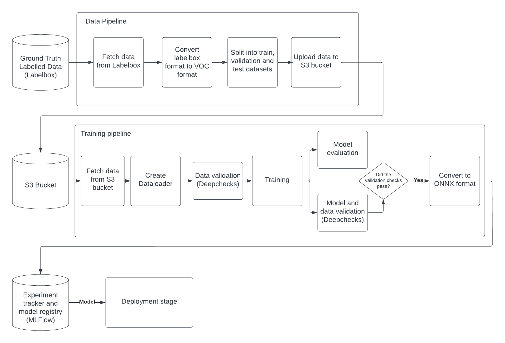

# ZenML

Overall Diagram of ZenML pipelines:



## Data Pipeline

Detailed configuration of all steps in the data pipeline in [config_data_pipeline.yaml](pipelines/data_pipeline/config_data_pipeline.yaml).

1. `ingest_data` step : This step collects the data from Labelbox using the Labelbox API and requires 1 parameter.
    * image_base_dir: Path to image directory containing images

    You must also export the following variables:
    ```bash
    # Labelbox API key
    export LABELBOX_API_KEY=""
    # Labelbox project ID
    export LABELBOX_PROJECT_ID=""
    ```

    As this is sensitive information it must be filled out with your own API key and project ID.

2. `labelbox_tov_voc` step : This step requires 2 parameters to convert the labels from labelbox json format to VOC format.
    * image_base_dir : The base directory of the images
    * labels_base_dir : The base directory to store the labels in VOC format

3. `split_data` step: This step requires 3 parameters to split the dataset into train-val and test dataset.
    * image_base_dir : The base directory of the images
    * labels_base_dir : The base directory storing the labels in VOC format
    * train_test_split_ratio: A float in range [0, 1] specifying the split ratio to split dataset into train-val and test dataset

4. `upload_data` step: This step requires 3 parameters to upload everything in the data folder to a S3 bucket.
    * data_base_dir: Path to the data folder containing all outputs from the data pipeline
    * service_name: The specific AWS service that we're accessing
    * bucket: Name of the S3 bucket

    You must also export the following variables:
    ```bash
    # AWS access key id
    export ACCESS_KEY_ID=""
    # AWS secret access key
    export SECRET_ACCESS_KEY=""
    ```
    Visit [AWS Account and Access Keys](https://docs.aws.amazon.com/powershell/latest/userguide/pstools-appendix-sign-up.html) for information on how to get your access key ID and secret access key.

## Training Pipeline

Detailed configuration of all steps in the training pipeline in [config_training_pipeline.yaml](pipelines/training_pipeline/config_training_pipeline.yaml).

1. `download_data` step: This step requires 3 parameters to download the data in VOC format from a S3 bucket.
    * dataset_base_dir : The path for where the data should be downloaded to
    * service_name : The specific AWS service that we're accessing
    * bucket_name : The name of the S3 bucket where the data is stored

2. `create_data_loader` step: This step requires 5 parameters to create 3 dataloaders for loading the training, validation and testing datasets.
    * dataset_base_dir : The base directory of images stored in VOC format and annotations
    * batch_size : How many samples per batch to load per iteration
    * use_aug : Whether to perform image augmentation on images to artificially expand the data-set
    * image_size : The size (width and height) of the image that will be resized to
    * num_worker : Number of workers for multi-process data loading

3. `validate_data` step: This step requires 2 parameters for checking the integrity of the train, val and test dataset.
    * net : The model to use for object detection
    * use_pretrained : Whether to use pretrained backbone only or together with a pretrained detection head

4. `trainer` step : This step requires 12 parameters to creating a model using PyTorch and some are used as hyperparamaters for model training.
    * models_folder : The path for where the trained model will be saved to
    * net : The model to use for object detection
    * use_pretrained : Whether to use pretrained backbone only or together with a pretrained detection head
    * lr : The learning rate for training the model
    * momentum: A hyperparamater used along with the SGD optimiser that helps to determine the direction to go during the gradient descent.
    * weight_decay : A hyperparamater used along with the SGD optimiser for regularisation by adding a small penalty to prevent overfiiting
    * t_max : The maximum number of iterations for Cosine Annealing Scheduler
    * epochs : Number of complete pass of the training dataset for training the model
    * print_freq : Frequency of printing loss statistics
    * score_threshold : Score threshold to filter bounding boxes
    * save_prediction : A boolean, save prediction images during the validation loop if True
    * prediction_folder : The path for saving the predictions images during the validation loop

5. `evaluation` step : This step requires 1 parameter to evaluate the trained model using the test loader dataset.
    * iou_cutoff : The intersection over union threshold

6. `validate_data_model` step : This step does not require any parameters to run Deepchecks' full suite on the data and model.

7. `export_onnx` step: This step requires 2 parameters to export the trained PyTorch model to ONNX format.
    * onnx_model_path : The path to save the ONNX format model
    * image_size : The image size to use for training
